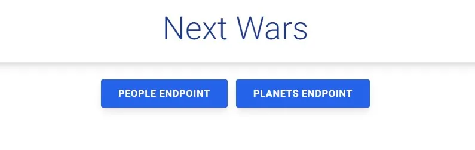
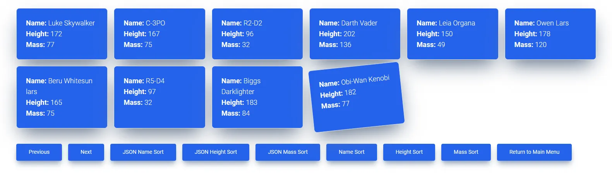
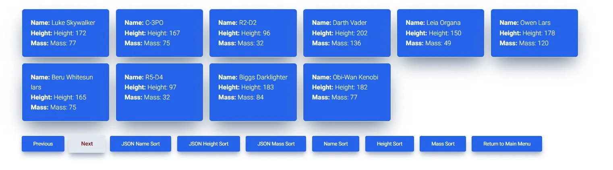
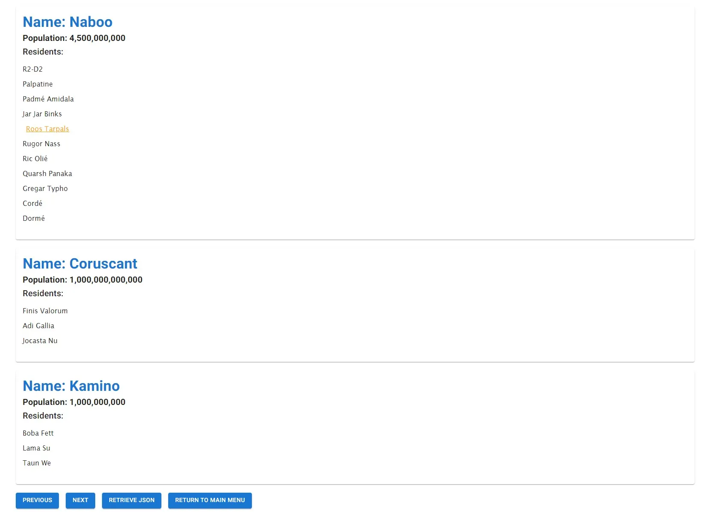
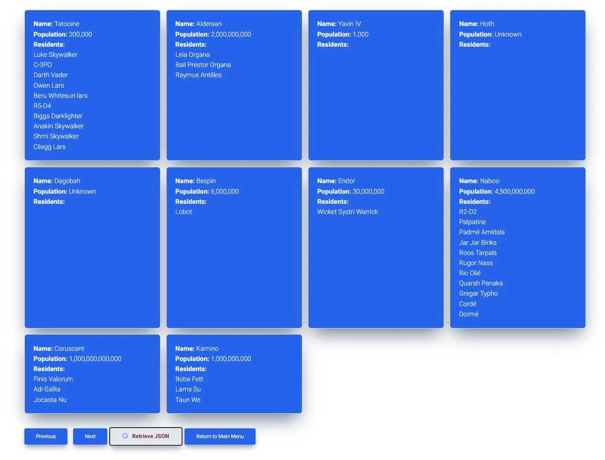
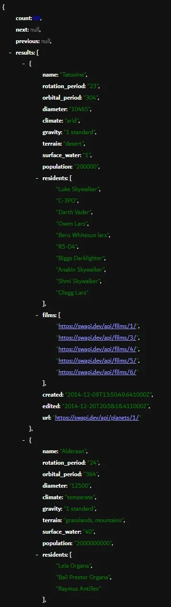

# next-wars

## See the application live [here](https://next-wars.vercel.app/)

Next Wars was built with Next.js, React, TypeScript, and Tailwind CSS to retrieve data from the Star Wars API. The application was designed around two endpoints. The people endpoint to retrieve all people and display some of their information on the client. The planets endpoint to retrieve planet information and replace the URLs in the residents arrays with the names of the residents.

The application allows users to paginate between the previous and next endpoints to fetch data. The sorting buttons allow for sorting between name, height, and mass. Dedicated JSON buttons are included to fetch directly from the API via the routes /api/people and /api/planets. The application currently allows ten people or planets to be retrieved with getStaticProps, and then allows the client to retrieve the next set with client-side fetching while caching the responses with the Cache API.

The next version of the application is a work in progress and will incorporate hand drawn images of the main characters.

---















## Installation Instructions

1. Clone the repo:

```sh
git clone https://github.com/xiraynedev/next-wars.git
```

2. Change directory:

```sh
cd next-wars
```

3. Install dependencies

```sh
npm i
```

4. Start the dev server:

```sh
npm run dev
```
